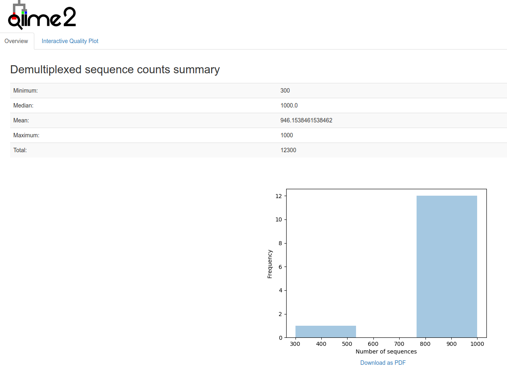
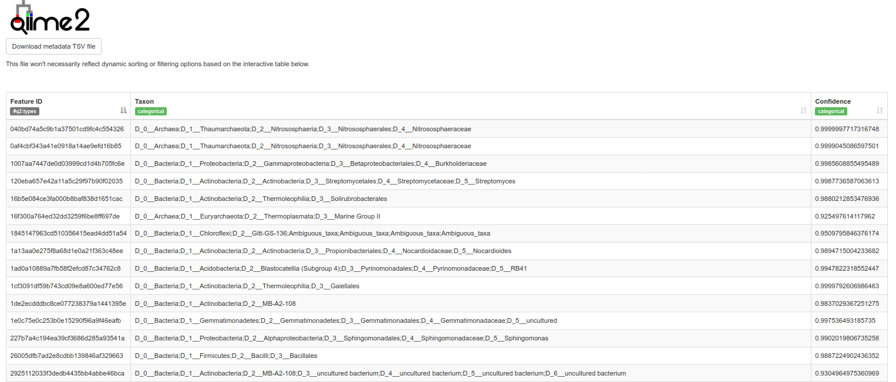

# nf-core/samba: Output

This document describes the output produced by the pipeline.

## Pipeline overview
The pipeline is built using [Nextflow](https://www.nextflow.io/)
and processes data using the following steps:

### Bioinformatic steps
* [Data integrity](#data-integrity) - Raw data integrity checking
* [Data importation](#data-importation) - Create QIIME2 objects
* [Data cleaning](#data-cleaning) - Primer removal
* [ASVs inference](#asvs-inference) - ASVs inference and counts table
* [OTUs calling](#otus-calling) - \[OPTIONAL\] Distribution and phylogeny based clustering
* [Differential abundance testing](#differential abundance testing) - ANCOM analysis
* [Remove sample contamination](#remove-sample-contamination) - \[OPTIONAL\] Samples decontamination based on control samples 
* [Taxonomic assignation](#taxonomic-assignation) - QIIME2 Naive bayesian classifier assignation
* [Phylogeny](#phylogeny) - ASVs sequences aligment and tree
* [Functional predictions](#functional-predictions) - \[OPTIONAL\] PICRUSt2 functionnal predictions

### Statistic steps
* [Data preparation](#data-preparation) - Create R-Phyloseq object
* [Alpha diversity](#alpha-diversity) - \[OPTIONAL\] Communities intra-specific diversity
* [Beta diversity](#beta-diversity) - \[OPTIONAL\] Communities inter-specific diversity
* [Descriptive Comparisons](#descriptive-comparisons) - \[OPTIONAL\] Based on UpsetR graph

### Final analysis report

* [Global analysis report](#global-analysis-report) - Synthesis and results of communities analysis

## Data integrity

**\[OPTIONAL\]**

Bash script used to check raw sequencing data and metadata file integrity.
- Demultiplexing control checks if barcodes are the same in reads names within a sample file (`--barcode_filter` default is 90%).
- Multiple sequencer detection checks if sequencer names are the same in the reads names within a sample file
- The primer ratio control checks if at least 70% (`--primer_filter` default is 70%) of the raw reads sequences within a sample the sequencing primer.
- The headers of the metadata file are checked in order to fit to the QIIME2 metadata requirements.

[Data integrity specific parameters](usage.md#data-integrity) can be set for nf-core/samba custom usage.
A data integrity CSV report **`data-integrity.csv`** is produced in the pipeline **output directory : `results/project_name/steps_data/01_data_integrity`**

## Data importation

[QIIME2 import](https://docs.qiime2.org/2019.10/tutorials/importing/) step creates :
- a QIIME2 object using QIIME2 manifest and metadata files
- QIIME2 reads count overview html statistics 

- QIIME2 html quality plots of the raw reads sequences

QIIM2 import report `index.html` is available in **output directory : `results/project_name/00_report/import_output`**

## Data cleaning

[QIIME2 Cutadapt](https://docs.qiime2.org/2019.10/plugins/available/cutadapt/) will remove primers from raw sequences, generate quality plots of cleaned and reads counts for each sample. Output report will create the same graphs as the ones created in data importation step.

[Cutadapt specific parameters](usage.md#raw-reads-cleaning) can be set for nf-core/samba custom usage.
QIIME2 cutadapt report `index.html` is available in **output directory : `results/project_name/00_report/trimmed_output`**

## ASVs inference

The inference of ASVs (Amplicon Sequence Variant) is performed using [QIIME2 Dada2](https://docs.qiime2.org/2019.10/plugins/available/dada2/) algorithm.
DADA2 can filter and trim cleaned reads before running an error model learning algorithm which will correct the reads if necessary before the ASVs inference. Then, reads for each ASVs are merged and chimeras are removed. Finally, an ASVs counting table for reach sample is generated.

[DADA2 specific parameters](usage.md#asvs-inference) can be set for nf-core/samba custom usage.

The **output directory : `results/project_name/00_report/dada2_output`** contains :
- QIIME2 DADA2 report `index.html` with the remaining sequences and ASVs in each sample.

- QIIME2 DADA2 report `sample-frequency-detail.html` with interactive ASVs counts for each samples metadata.

- QIIME2 DADA2 report `feature-frequency-detail.html` with ASVs frequency and observation counts in each sample.

- All ASVs sequences in a fasta file : `sequences.fasta`
- A biom counting table : `feature-table.biom`

## OTUs calling

**\[OPTIONAL\]**

[QIIME2 dbotu3](https://library.qiime2.org/plugins/q2-dbotu/4/) plugin will call OTUs from ASVs distribution across samples and phylogenetic tree.

The **output directory : `results/project_name/00_report/dbotu3_output`** contains :
- QIIME2 dbOTU3 report `index.html` with sample and feature frequencies
[!QIIME2 dbOTU3 report](images/qiime2-dbotu3-report.png)
- All ASVs sequences in a fasta file : `sequences.fasta`
- A biom counting table : `feature-table.biom`

## Differential abundance testing

[QIIME2 ANCOM](https://docs.qiime2.org/2019.10/plugins/available/composition/ancom/) analysis will compare the composition of microbiomes and identify ASVs that differ in abundance.
[ANCOM variable](usage.md#differential-abundance-testing) can be specified in samba parameters.

The **output directory : `results/project_name/00_report/ancom_output`** contains :
- the ANCOM analysis report : `export_ancom_[ANCOM_VAR]/index.html`  

- the ANCOM analysis report at family level : `export_ancom_[ANCOM_VAR]_family/index.html`  
- the ANCOM analysis report at genus level : `export_ancom_[ANCOM_VAR]_genus/index.html`  

## Remove sample contamination

yy**\[OPTIONAL\]**

[microDecon](https://github.com/donaldtmcknight/microDecon) R package is used to remove contamination from control samples to experiment samples.
[Controls samples and number of samples to decontaminate](usage.md#decontamination) are specified in samba parameters.

The **output directory : `results/project_name/00_report/microDecon`** contains :
- the ASVs concerned sequences in `decontaminated_ASV.fasta`
- the decontaminated counting table in TSV format : `decontaminated_ASV_table.tsv`
- the list of removed ASVs : `ASV_removed.txt`
- the abundance of the removed ASVs : `abundance_removed.txt`

## Taxonomic assignation

[QIIME2 feature-classifier](https://docs.qiime2.org/2019.10/tutorials/feature-classifier/) will use a Naive Bayes classifier that can be used on global marker reference database or be trained on only the region of the target sequences. Check the [available parameters](usage.md#taxonomic-assignation) for this step.

The **output directory : `results/project_name/00_report/taxo_output`** contains :
- QIIME2 taxonomy report `index.html` with ASVs list, taxonomic assignation and confidence score.

- the merging of counts and taxonomy for each ASVs in a TSV file : `ASV_taxonomy.tsv`

## Phylogeny

QIIME2 sequences alignement and phylogeny are performed with [MAFFT](https://docs.qiime2.org/2019.10/plugins/available/alignment/) and [Fastree](https://docs.qiime2.org/2019.10/plugins/available/phylogeny/) algorithms.

The **output directory : `results/project_name/00_report/tree_export_dir`** contains :
- the ASVs phylogenetic tree in newick format : `tree.nwk`

## Functional predictions

**\[OPTIONAL\]**

[QIIME2 picrust2](https://library.qiime2.org/plugins/q2-picrust2/13/) plugin is used to get EC, KO and MetaCyc pathway predictions base on 16S data.

The **output directory : `results/project_name/00_report/q2-picrust2_output`** contains :

