# nf-core/samba: Output

This document describes the output produced by the pipeline.

## Pipeline overview
The pipeline is built using [Nextflow](https://www.nextflow.io/)
and processes data using the following steps:

### Bioinformatic steps
* [Data integrity](#data-integrity) - Raw data integrity checking
* [Data importation](#data-importation) - Create QIIME2 objects
* [Data cleaning](#data-cleaning) - Primer removal
* [ASVs inference](#asvs-inference) - ASVs inference and counts table
* [OTUs calling](#otus-calling) - \[OPTIONAL\] Distribution and phylogeny based clustering
* [Differential abundance testing](#differential abundance testing) - ANCOM analysis
* [Remove sample contamination](#remove-sample-contamination) - \[OPTIONAL\] Samples decontamination based on control samples 
* [Taxonomic assignation](#taxonomic-assignation) - QIIME2 Naive bayesian classifier assignation
* [Phylogeny](#phylogeny) - ASVs sequences aligment and tree
* [Functional predictions](#functional-predictions) - \[OPTIONAL\] PICRUSt2 functionnal predictions

### Statistic steps
* [Data preparation](#data-preparation) - Create R-Phyloseq object
* [Alpha diversity](#alpha-diversity) - \[OPTIONAL\] Communities intra-specific diversity
* [Beta diversity](#beta-diversity) - \[OPTIONAL\] Communities inter-specific diversity
* [Descriptive Comparisons](#descriptive-comparisons) - \[OPTIONAL\] Based on UpsetR graph

### Final analysis report

* [Global analysis report](#global-analysis-report) - Synthesis and results of communities analysis

## Data integrity

**\[OPTIONAL\]**

Bash script used to check raw sequencing data and metadata file integrity.
- Demultiplexing control checks if barcodes are the same in reads names within a sample file (`--barcode_filter` default is 90%).
- Multiple sequencer detection checks if sequencer names are the same in the reads names within a sample file
- The primer ratio control checks if at least 70% (`--primer_filter` default is 70%) of the raw reads sequences within a sample the sequencing primer.
- The headers of the metadata file are checked in order to fit to the QIIME2 metadata requirements.

[Data integrity specific parameters](usage.md#data-integrity) can be set for nf-core/samba custom usage.
A data integrity CSV report **`data-integrity.csv`** is produced in the pipeline **output directory : `results/[PROJECT_NAME]/steps_data/01_data_integrity`**

## Data importation

[QIIME2 import](https://docs.qiime2.org/2019.10/tutorials/importing/) step creates :
- a QIIME2 object using QIIME2 manifest and metadata files
- QIIME2 reads count overview html statistics 

- QIIME2 html quality plots of the raw reads sequences
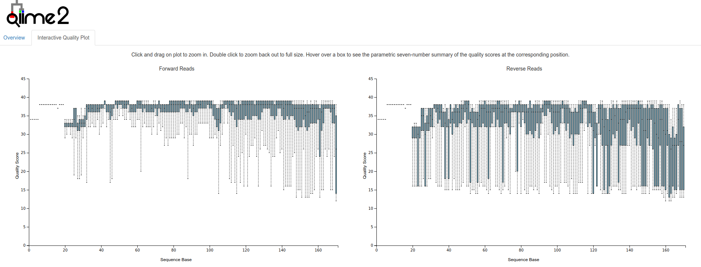

QIIM2 import report `index.html` is available in **output directory : `results/[PROJECT_NAME]/00_report/import_output`**

## Data cleaning

[QIIME2 Cutadapt](https://docs.qiime2.org/2019.10/plugins/available/cutadapt/) will remove primers from raw sequences, generate quality plots of cleaned and reads counts for each sample. Output report will create the same graphs as the ones created in data importation step.

[Cutadapt specific parameters](usage.md#raw-reads-cleaning) can be set for nf-core/samba custom usage.
QIIME2 cutadapt report `index.html` is available in **output directory : `results/[PROJECT_NAME]/00_report/trimmed_output`**

## ASVs inference

The inference of ASVs (Amplicon Sequence Variant) is performed using [QIIME2 Dada2](https://docs.qiime2.org/2019.10/plugins/available/dada2/) algorithm.
DADA2 can filter and trim cleaned reads before running an error model learning algorithm which will correct the reads if necessary before the ASVs inference. Then, reads for each ASVs are merged and chimeras are removed. Finally, an ASVs counting table for reach sample is generated.

[DADA2 specific parameters](usage.md#asvs-inference) can be set for nf-core/samba custom usage.

The **output directory : `results/[PROJECT_NAME]/00_report/dada2_output`** contains :
- QIIME2 DADA2 report `index.html` with the remaining sequences and ASVs in each sample.

- QIIME2 DADA2 report `sample-frequency-detail.html` with interactive ASVs counts for each samples metadata.
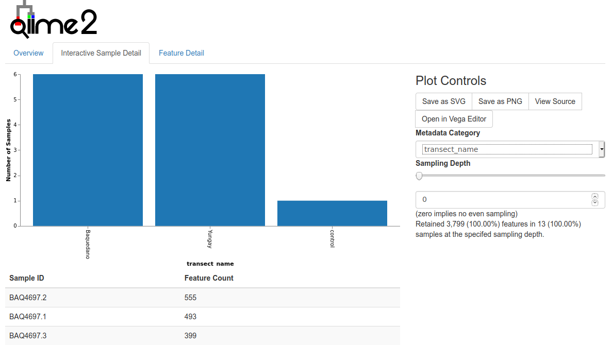
- QIIME2 DADA2 report `feature-frequency-detail.html` with ASVs frequency and observation counts in each sample.
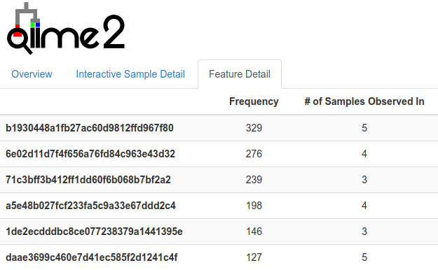
- All ASVs sequences in a fasta file : `sequences.fasta`
- A biom counting table : `feature-table.biom`

## OTUs calling

**\[OPTIONAL\]**

[QIIME2 dbotu3](https://library.qiime2.org/plugins/q2-dbotu/4/) plugin will call OTUs from ASVs distribution across samples and phylogenetic tree.

The **output directory : `results/[PROJECT_NAME]/00_report/dbotu3_output`** contains :
- QIIME2 dbOTU3 report `index.html` with sample and feature frequencies
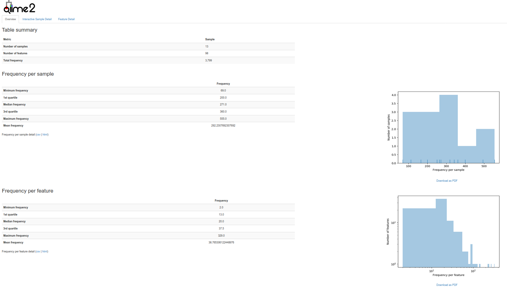
- All ASVs sequences in a fasta file : `sequences.fasta`
- A biom counting table : `feature-table.biom`

## Differential abundance testing

[QIIME2 ANCOM](https://docs.qiime2.org/2019.10/plugins/available/composition/ancom/) analysis will compare the composition of microbiomes and identify ASVs that differ in abundance.
[ANCOM variable](usage.md#differential-abundance-testing) can be specified in samba parameters.

The **output directory : `results/[PROJECT_NAME]/00_report/ancom_output`** contains :
- the ANCOM analysis report : `export_ancom_[ANCOM_VAR]/index.html`  
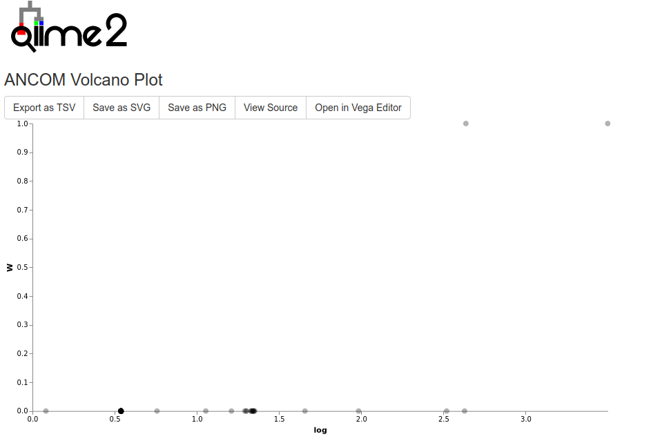
- the ANCOM analysis report at family level : `export_ancom_[ANCOM_VAR]_family/index.html`  
- the ANCOM analysis report at genus level : `export_ancom_[ANCOM_VAR]_genus/index.html`  

## Remove sample contamination

**\[OPTIONAL\]**

[microDecon](https://github.com/donaldtmcknight/microDecon) R package is used to remove contamination from control samples to experiment samples.
[Controls samples and number of samples to decontaminate](usage.md#decontamination) are specified in samba parameters.

The **output directory : `results/[PROJECT_NAME]/00_report/microDecon`** contains :
- the ASVs concerned sequences in `decontaminated_ASV.fasta`
- the decontaminated counting table in TSV format : `decontaminated_ASV_table.tsv`
- the list of removed ASVs : `ASV_removed.txt`
- the abundance of the removed ASVs : `abundance_removed.txt`

## Taxonomic assignation

[QIIME2 feature-classifier](https://docs.qiime2.org/2019.10/tutorials/feature-classifier/) will use a Naive Bayes classifier that can be used on global marker reference database or be trained on only the region of the target sequences. Check the [available parameters](usage.md#taxonomic-assignation) for this step.

The **output directory : `results/[PROJECT_NAME]/00_report/taxo_output`** contains :
- QIIME2 taxonomy report `index.html` with ASVs list, taxonomic assignation and confidence score.

- the merging of counts and taxonomy for each ASVs in a TSV file : `ASV_taxonomy.tsv`

## Phylogeny

QIIME2 sequences alignement and phylogeny are performed with [MAFFT](https://docs.qiime2.org/2019.10/plugins/available/alignment/) and [Fastree](https://docs.qiime2.org/2019.10/plugins/available/phylogeny/) algorithms.

The **output directory : `results/[PROJECT_NAME]/00_report/tree_export_dir`** contains :
- the ASVs phylogenetic tree in newick format : `tree.nwk`

## Functional predictions

**\[OPTIONAL\]**

[QIIME2 picrust2](https://library.qiime2.org/plugins/q2-picrust2/13/) plugin is used to get EC, KO and MetaCyc pathway predictions base on 16S data.
Picrust2 [HSP method and NSTI cut-off](images/#predict-functionnal-abundance) can be modified in the workflow parameters.

The **output directory : `results/[PROJECT_NAME]/00_report/picrust2_output`** contains :
- an NDMS for each EC, KO and MetaCyc pathways for the selected variable. Example for EC :
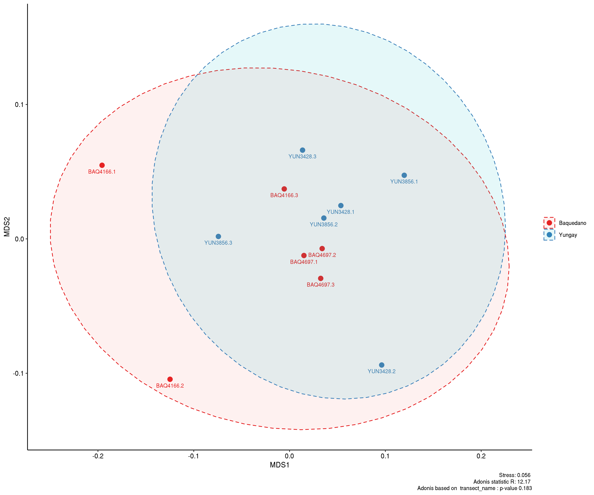
- a picrust analysis report `q2-picrust2_output/pathway_abundance_visu/index.html` with pathways frequencies.

## Data preparation

In order to perform diversity analysis, a R [Phyloseq](https://joey711.github.io/phyloseq/) object is created with the counting table, the sample metadata description and the ASVs phylogenetic tree.

The **output directory : `results/[PROJECT_NAME]/00_report/R/DATA`** constains the Phyloseq object and the counting table ready for performing statistics analysis.

## Alpha diversity

In order to evaluate samples intra-specific communities diversity, several diversity indexes are calculated :
- **Observed** : the sample richness, ie. the number of different ASVs per sample
- **Chao1** : the predicted richness index
- **InvSimpson** : the probability that two sequences taken at random from a sample belongs to same taxa
- **Shannon** : the entropy index reflects the specific diversity of the sample. The more the index is high, the more the diversity and equitabily are high.
- **Pielou** : the community equitability index
Then, taxonomic barplots from phylum to genus are produced.

[Alpha diversity parameters](usage.md#statistics) can be specified in the workflow.

The **output directory : `results/[PROJECT_NAME]/00_report/R/FIGURES/alpha_diversity`** contains :
- a samples rarefaction curve : `rarefaction_curve.png`

- the diversity indexes plot : `diversity_index/alpha_div_[VARNAME].png`
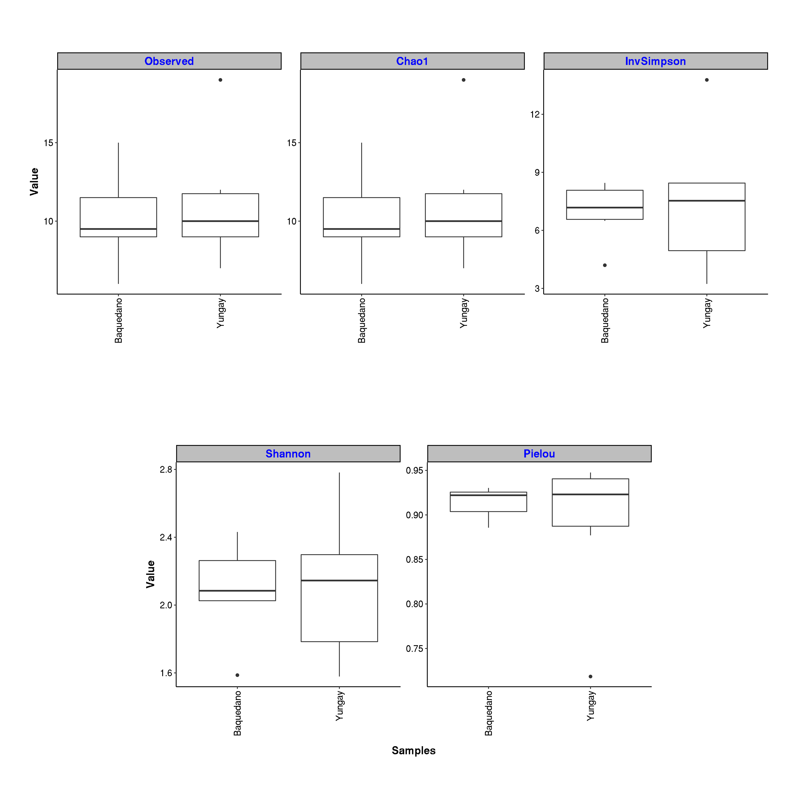
- the taxonomic barplots : `diversity_barplots/[VARNAME]` from Phylum to Genus
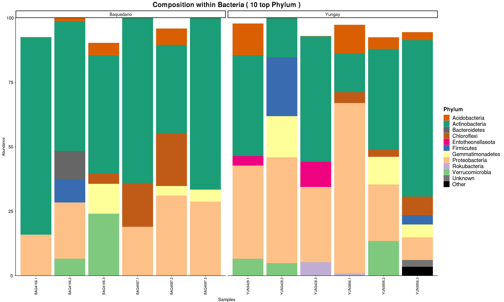
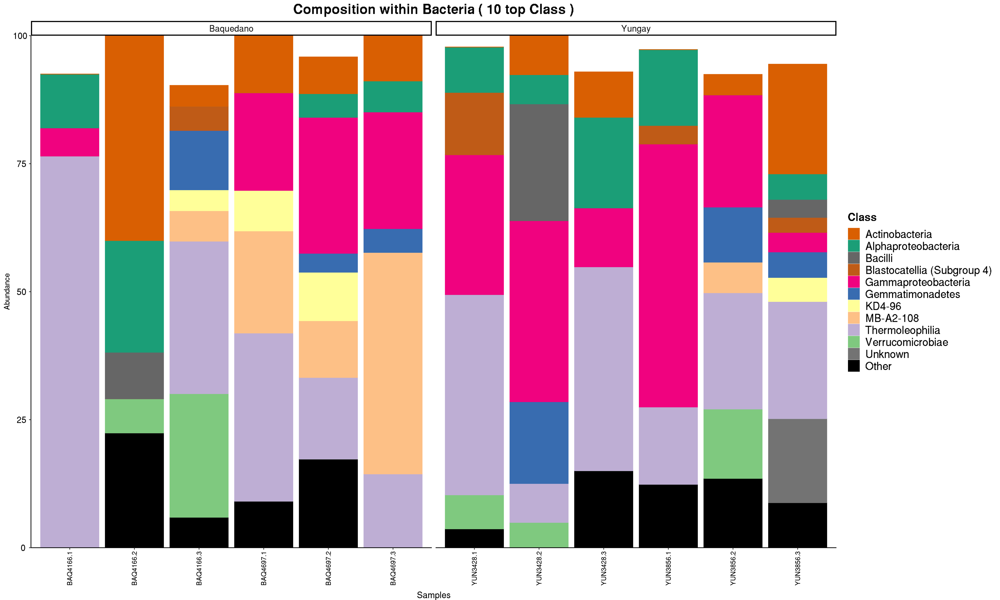
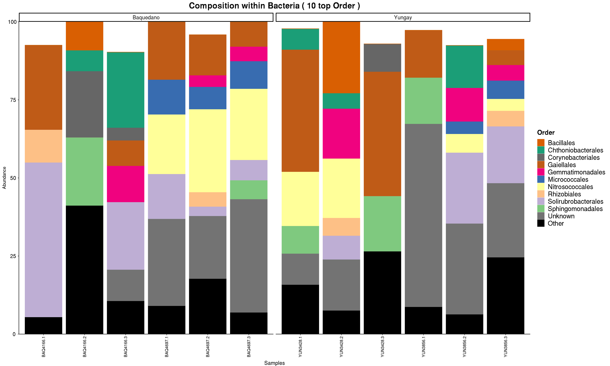

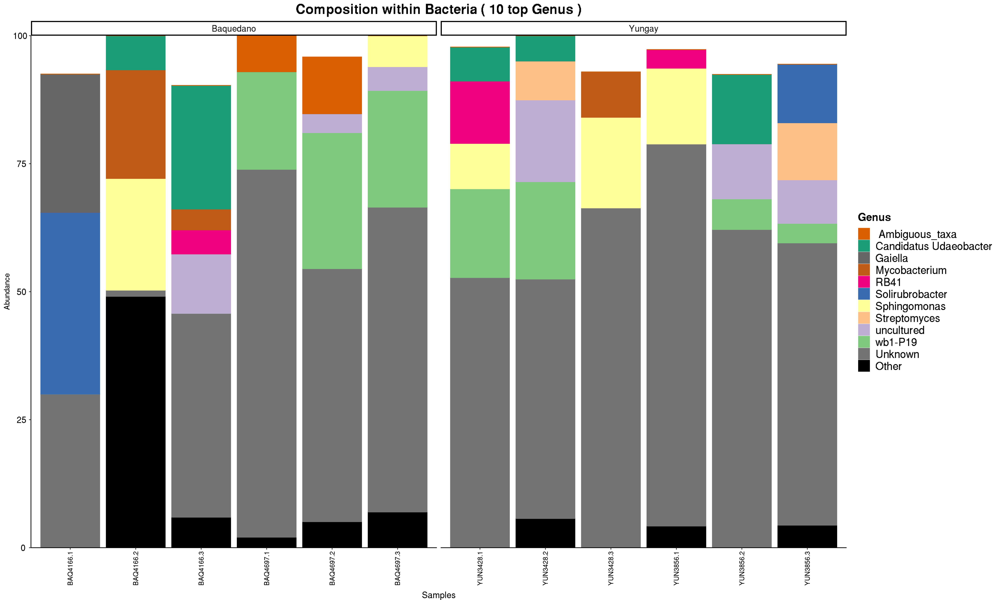

## Beta diversity

Sample distances are evaluated through beta diversity analyses. The ASV count table will be normalized to calculate beta diversity distance matrices.

Four normalization methods are used in samba :
- **No-normalization** : the beta diversity is calculated on raw ASVs counts. Warning : We do not recommend to use theses results for your data interpretation, this normalization aims to help to select the normalization method that fits the best your dataset.
- **Rarefaction** : the rarefaction normalization consists in reducing the number of sequences in the samples to the size of the smallest sample. This method is recommended if all your samples have almost the same sequences number repartition. Beware if you have samples with low and high number of sequences, you could lost diversity and end to a bad results interpretation.
- **[Bioconductor DESeq2](http://bioconductor.org/packages/release/bioc/html/DESeq2.html)** normalization : DESeq2 has been widely used in RNA-seq analysis to detect differential gene expression. This method can also be used as metabarcoding data normalization to evaluate if an ASV is more or less present through samples. Remind that the ending normalised table will contain positive and negative values and will thereby not be usable as an input for further analysis.
- **[Bioconductor metagenomeSeq CSS](https://rdrr.io/bioc/metagenomeSeq/man/cumNormMat.html)** : Cumulative Sum Scaling returns a matrix normalized by scaling counts up to and including the pth quantile. The method will give more weight to rare species.

For each normalization method, four distance matrices are calculated :
- **Jaccard** distance is a qualitative measure which indicates if an ASV is present or not. It will take 0 value if the ASV is not present in the sample or 1 if it is present, no matter if the ASV is rare or abundant.
- **Bray-Curtis** distance is a quantitive measure which is based on specific ASV abundance over the samples. If two samples share the same communities, their Bray-Curtis distance will be equal to 0 whereas it will tend to 1 if the communities between the samples are different.
- **Unifrac** distance is a qualitative distance based on the shared phylogenetic tree branches of the samples.
- **Weighted-Unifrac** distance is a quantitative distance based on ASV abundance and on shared phylogenetic tree branches of the samples.

These distance matrices are represented through PCoA and NMDS (including ADONIS test) ordination plots. A Hierarchical clustering of the samples is also provided by samba.

[Beta diversity parameters](usage.md#statistics) can be specified in the workflow.
 
The **output directory : `results/[PROJECT_NAME]/00_report/R/FIGURES/beta_diversity_[NORM_METHOD]`** contains 4 directories :
- PCoA with PCoA plots images (png and svg format) for each distance matrix
- NMDS with NMDS plots images (png and svg format) for each distance matrix
- Hierachical_Clustering with hierarchical clustering plots images (png and svg format) for each distance matrix using clustering method set in samba parameters.
- ExpVar with pie charts images (png and svg format) for each distance matrix representing the percentage of explained variance for each experiment variables.
- Files variance_signifiance_tests_[NORM_METHOD].txt for each distance (i.e jaccard, bray, unifrac, wunifrac) with Adonis test results combining each experiment variables.

Here are some examples of the plots for beta diversity analysis available in samba workflow (example with DESeq2 normalization method and Bray-Curtis distance matrix) based on the selected experiment variable transect_name :

- Pie chart : Percentage of explained variance for each experiment variable :
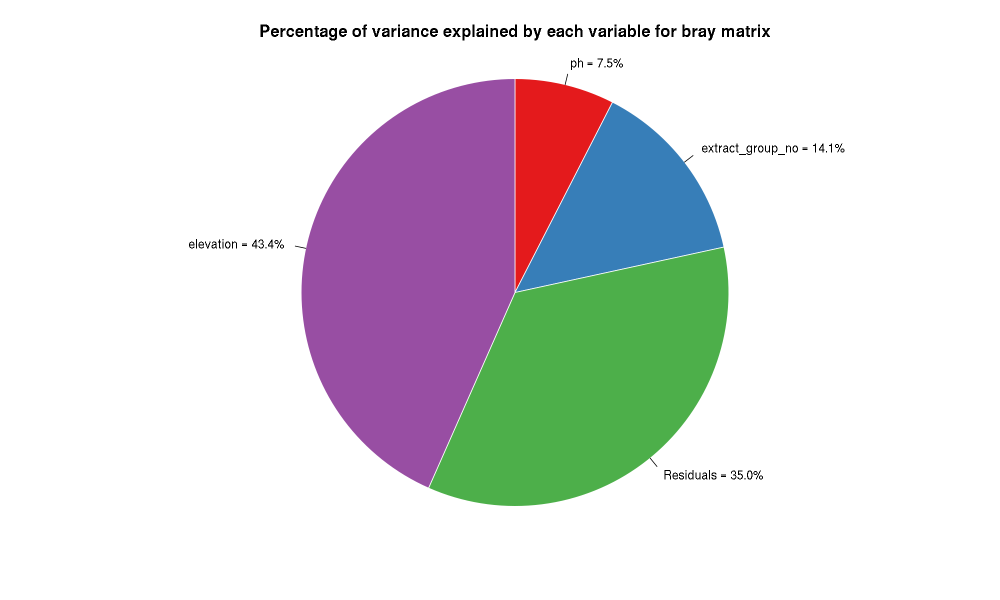
- PCoA plot :
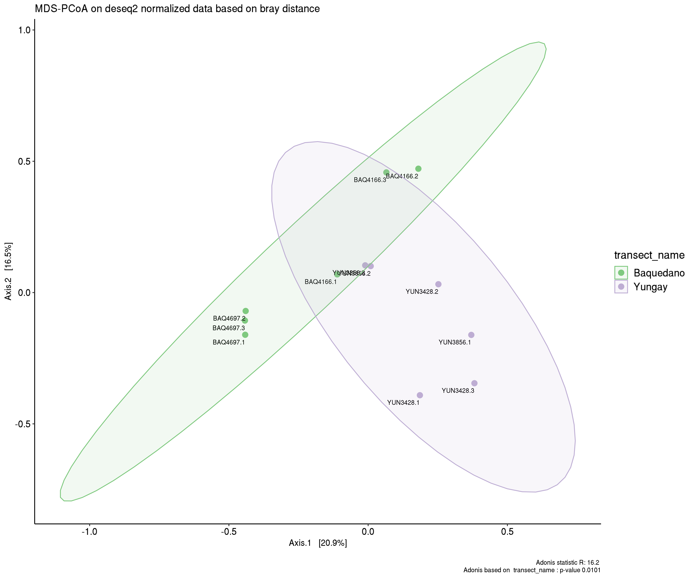
- NMDS plot :
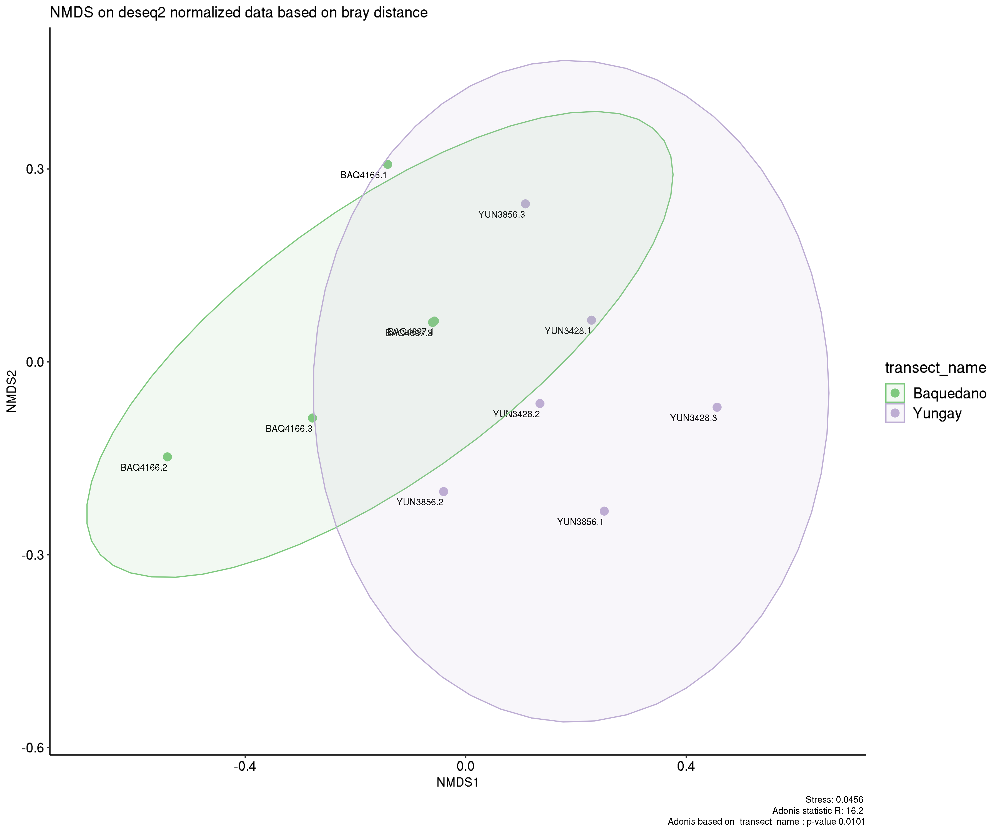
- Hierarchical clustering with Ward.D2 method :
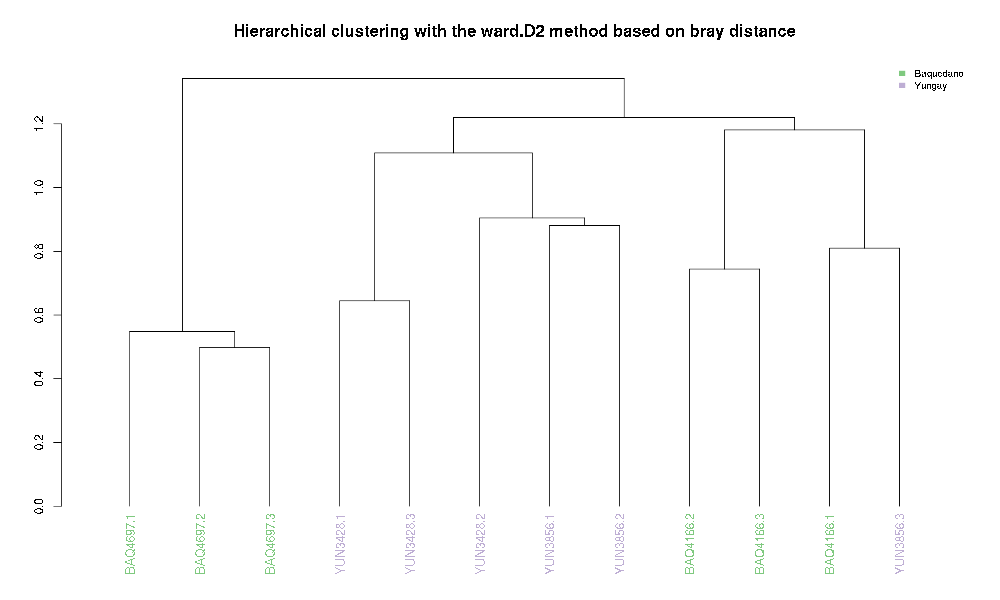

## Descriptive comparisons

This step is based on [UpSetR package](https://github.com/hms-dbmi/UpSetR) and provide an alternative to Venn diagram to deal with more than 3 sets.

[Descriptive comparisons parameters](usage.md#statistics) can be specified.

The **output directory : `results/[PROJECT_NAME]/00_report/R/FIGURES/descriptive_comparison`** contains the UpSetR graphs images in png and svg format.

In the test dataset, this graph enables to compare the number of ASVs and their abundance between samples group selected variable regarding to the total of ASVs by sample groups :
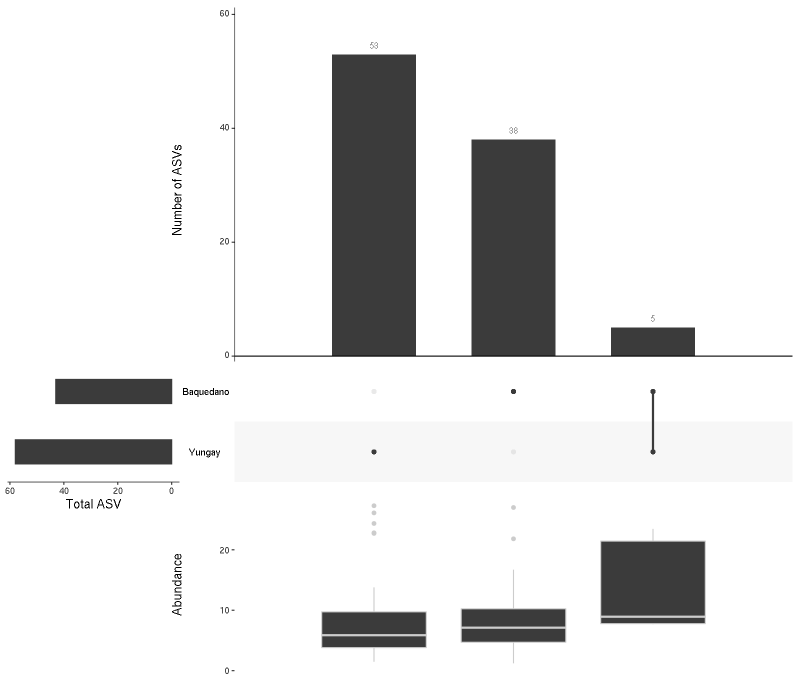

## Global analysis report

All samba workflow results are stored in a global analysis available in **`results/[PROJECT_NAME]/00_report/SAMBA_report.html`**. This report is based on a Jinja2 template and gives a synthesis of the community profiles and characteristics of your dataset :
- Bioinformatic processes are described with software versions and used parameters and important results for each step.
- Statistical analyses results can be quickly compared for each variable of interest to understand environmental or experiments effects and samples similarities and differences.

